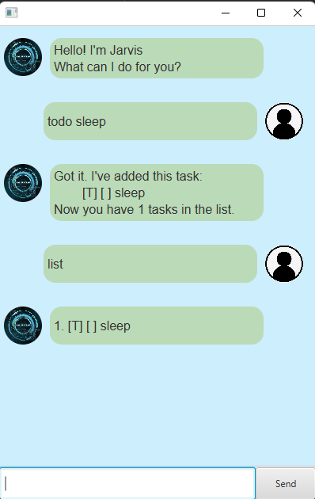

# Jarvis

Jarvis is a personal assistant for managing all tasks and events. It provides a nice Graphical User Interface (GUI) for keeping track of all your tasks.

## Features 

- [Add a task](#add-task)
  - Todo
  - Deadline
  - Event
- [Delete a task](delete-task)
- [Find task](#find-task)
- [List tasks](#list-tasks)
- [Mark task](#mark-task)
- [Unmark task](#unmark-task)
- [Tagging](#tagging)
  - [Tag a task](#tag-task)
  - [List tags](#list-tags)
  - [List task tags](#list-tasktags)
- [Quit](#quit)

### Add-Task

Add a new task to your list. Supported task types: `todo`, `deadline`, `event`.

General format: `TASKTYPE DESCRIPTION [/by DEADLINE] [/at EVENT_TIMING]`

`todo` - Basic task

Format: `todo DESCRIPTION`

`deadline` - Tasks that have a deadline

Format: `deadline DESCRIPTION /by DEADLINE`

`event` - Events that occur at a certain time

Format: `event DESCRIPTION /at EVENT_TIMING`

### Delete-Task

Delete a task from the list.

Format: `delete TASK_INDEX`

### Find-Task

Find a task from the list given a specific keyword.

Format: `find KEYWORD`

### List-Tasks

List all tasks. 

Format: `list`

### Mark-Task

Mark a task from the list as completed.

Format: `mark TASK_INDEX`

### Unmark-Task

Mark a task from the list as uncompleted.

Format: `unmark TASK_INDEX`

### Tagging

#### Tag-Task

Tag a task with a new or existing tag.

Format: `tag TASK_INDEX TAG_NAME`

#### List-Tags

List all tags.

Format: `tags`

#### List-Tasktags

List all tags associated with a task.

Format: `tasktags TASK_INDEX`

### Quit

Quit and exit the program.

Format: `bye`

